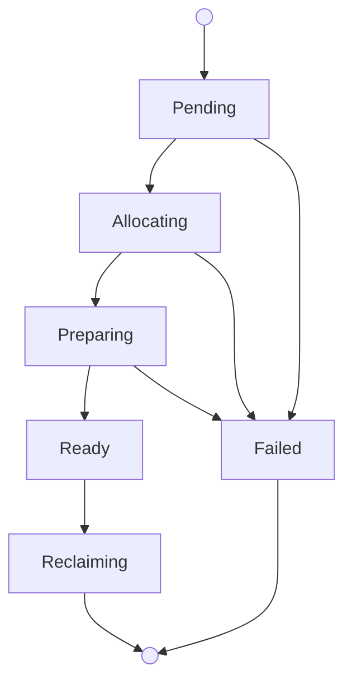

Each bare-metal machine gives you exclusive use of one physical Apple Silicon
Mac. Choose bare metal when you need dedicated hardware, root-capable admin
access, direct device control, or the full power of a physical host.

You manage bare metal through the `mthr` CLI or by creating `BareMetalMachine`
resources in your Mount Thor Kubernetes control plane.

## Lifecycle



What to know:

- A `BareMetalMachine` stays allocated until you free it. Closing an SSH
  session does not release the machine.
- When you connect, you get a machine-scoped macOS user with local admin access
  and passwordless `sudo`.
- Mount Thor bills each bare-metal machine for a minimum of 24 hours. If you
  free a machine after 2 hours, you are still billed for 24 hours.
- If spot capacity is enabled for your account, Mount Thor uses reserved
  capacity first and allocates spot machines when reserved capacity is
  exhausted.

## Allocate a Machine

Check your fleet capacity summary and available images:

```bash
mthr fleet summary
mthr fleet images
```

Allocate a bare-metal Mac:

```bash
mthr bm allocate build-1 --class m4-24g --image xcode-16
```

This creates a `BareMetalMachine` resource. Mount Thor selects a host from your
reserved (or spot) capacity, installs the image, and prepares the machine for
access.

Wait for the machine to reach the `Ready` state, then connect.

### Allocate with kubectl

You can also create the underlying Kubernetes resource directly:

```yaml
apiVersion: compute.mountthor.com/v1alpha1
kind: BareMetalMachine
metadata:
  name: build-1
spec:
  class: m4-24g
  image: xcode-16
```

```bash
kubectl apply -f build-1.yaml
kubectl wait baremetalmachine build-1 \
  --for=jsonpath='{.status.readyForAccess}'=true \
  --timeout=30m
```

Check machine status:

```bash
kubectl get baremetalmachine build-1 \
  -o jsonpath='{.status.phase}{" readyForAccess="}{.status.readyForAccess}{" failure="}{.status.failureCode}{"\n"}'
```

When the output shows `Ready readyForAccess=true`, the machine is ready to
connect. If `failureCode` is populated, use that value when contacting Mount
Thor support.

## Connect with SSH

SSH into a ready machine:

```bash
mthr bm ssh build-1
```

The CLI checks that the machine is ready for access (waiting up to 30 seconds
by default), requests a short-lived SSH grant from the Mount Thor access
broker, and launches `ssh`. No separate access resource is needed — the CLI
handles the entire flow.

Grants expire after 4 hours by default. When a grant expires, run
`mthr bm ssh` again to get a new one. The machine stays allocated.

## List and Inspect

List all bare-metal machines:

```bash
mthr bm ls
```

Get details for a specific machine:

```bash
mthr bm get build-1
```

Or with kubectl:

```bash
kubectl get baremetalmachines
kubectl get baremetalmachine build-1 -o yaml
```

## Free a Machine

Release a machine when you are done:

```bash
mthr bm free build-1
```

Or with kubectl:

```bash
kubectl delete baremetalmachine build-1
```

Mount Thor immediately revokes any active access grants, then runs its full
reclaim pipeline: wipe, MDM erase, re-enroll, sanitization verification, and
return to pool. The machine enters the `Reclaiming` phase during cleanup. You
cannot reconnect to a machine once you've freed it.

## Fleet and Capacity

View your fleet summary, including reserved and spot capacity:

```bash
mthr fleet summary
```

Example output:

```text
Reserved
  Bare metal: 3 / 4 in use, 1 available
  VM CPU:     48 / 80 vCPU in use
  VM memory:  96 / 160 GiB in use
  VM disk:    800 / 2000 GiB in use

Spot
  Enabled: yes
  This month: $82 / $500
  Status: ok

Machines
  bm build-1     ready      reserved
  bm build-2     ready      reserved
  vm dev         running    reserved
  vm ci-1        running    spot
```

### Spot Capacity

If your account has spot capacity enabled, Mount Thor allocates spot machines
when reserved capacity is exhausted. Manage spot policy with:

```bash
mthr fleet spot enable --monthly-spend-limit 500
mthr fleet spot set-limit 1000
mthr fleet spot disable
```

Spot spend limits are in dollars. Mount Thor warns at 80% and 90% of the
monthly cap and stops admitting new spot allocations at 100%.

## Kubernetes Resource Reference

### BareMetalMachine

| Field | Required | Description |
|---|---|---|
| `spec.class` | yes | Machine class (e.g. `m4-24g`, `m4-pro-128g`). Immutable. |
| `spec.image` | no | Image name (e.g. `xcode-16`). Defaults applied by the platform. |
| `spec.region` | no | Target region when multiple regions are available. Immutable. |

### MachineClass

Read-only catalog of available hardware classes:

```bash
kubectl get machineclasses
```

```yaml
apiVersion: compute.mountthor.com/v1alpha1
kind: MachineClass
metadata:
  name: m4-24g
spec:
  cpuFamily: apple-m4
  memoryGiB: 24
  regions:
    - us-west
```

### Image

Unified image catalog for both bare metal and VMs:

```bash
mthr fleet images
kubectl get images
```

```yaml
apiVersion: compute.mountthor.com/v1alpha1
kind: Image
metadata:
  name: xcode-16
spec:
  source: mount-thor
  displayName: Xcode 16
  targets:
    - bareMetal
    - vm
status:
  ready: true
```

### Status Contract

Every `BareMetalMachine` exposes a consistent status shape:

```yaml
status:
  observedGeneration: 1
  phase: Ready
  capacitySource: reserved
  readyForAccess: true
  failureCode: null
  access:
    ssh: true
    desktop: true
    tunnels: true
  conditions:
    - type: ReadyForAccess
      status: "True"
      reason: HostPrepared
      message: "Machine is ready for access."
```

Lifecycle phases: `Pending`, `Allocating`, `Preparing`, `Ready`, `Reclaiming`,
`Failed`.

The `capacitySource` field shows whether the machine is using `reserved` or
`spot` capacity.
