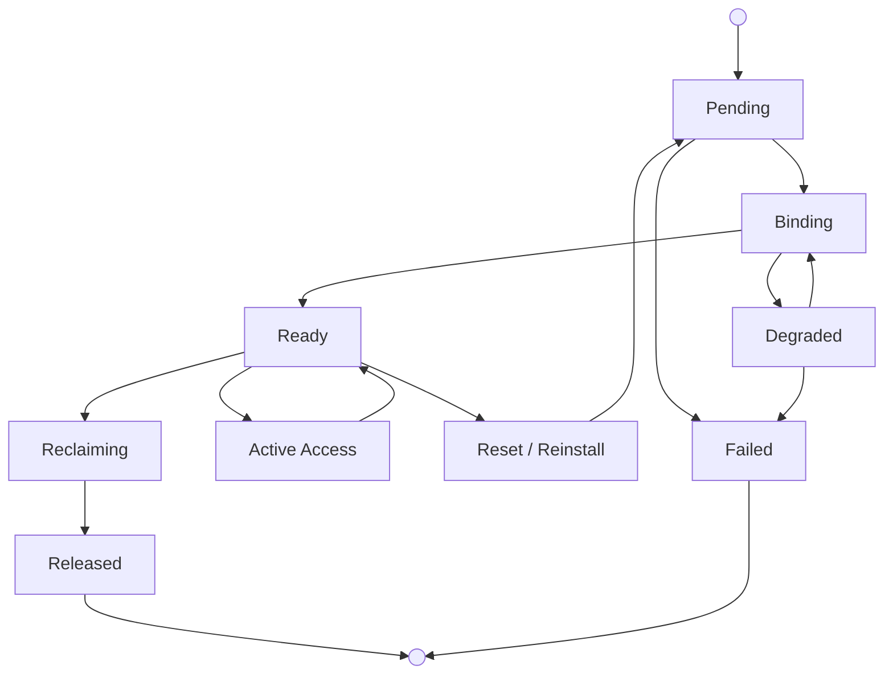

Each bare metal lease gives you exclusive use of one physical Apple Silicon Mac.
Create one lease for each Mac you want to use. Choose bare metal when you need
dedicated hardware, root-capable admin access, direct device control, or the
flexibility and power of a full host.

You manage bare metal with Kubernetes Custom Resources. The main resources are
`MacLease` for the Mac, `MacAccessSession` for temporary SSH or Screen Sharing
access, and `MacLeaseOperation` for reset and reinstall.

## Bare Metal Lifecycle



What to know:

- A lease stays allocated until you delete it. Closing SSH or Screen Sharing
  does not release the Mac.
- If on-demand capacity is enabled for your account, Mount Thor uses your
  reserved capacity first and starts on-demand leases when unreserved capacity is
  available.
- When you connect to a bare metal Mac, you get a lease-scoped macOS user with
  local admin access and passwordless `sudo`.
- Mount Thor bills each bare metal lease for a minimum of 24 hours. If you
  delete a lease after 2 hours, you are still billed for 24 hours.

## Bare Metal Resources

| Resource | Purpose | When you use it |
|---|---|---|
| `MacLeaseClass` | Hardware profile, such as a Mac mini class | Before lease creation |
| `MacImageChannel` | Approved macOS image channel | Before lease creation |
| `MacLease` | The physical Mac allocation | Provision, observe, and release bare metal |
| `MacAccessSession` | Temporary access grant for an existing lease | Open SSH or Screen Sharing |
| `MacLeaseOperation` | Reset or reinstall flow for an existing lease | Recover or refresh a leased Mac |

The `MacLease` is the long-lived resource. `MacAccessSession` objects are
connection windows for that lease. `MacLeaseOperation` acts on the lease and is
blocked while someone is connected or access is still opening.

## Provision a Physical Mac

Provision a physical Mac by creating a `MacLease`.

List the hardware profiles and macOS image channels enabled for your account:

```bash
kubectl --kubeconfig "$KCFG" get macleaseclasses
kubectl --kubeconfig "$KCFG" get macimagechannels
```

Use one `MacLeaseClass` name for `leaseClassRef` and one `MacImageChannel` name
for `imageChannelRef`. In this example, `m4-24g` is the hardware profile and
`xcode-16-stable` is the macOS image.

Save the following as `bm-01.json`:

```json
{
  "apiVersion": "control.mountthor.dev/v1alpha1",
  "kind": "MacLease",
  "metadata": {
    "name": "bm-01"
  },
  "spec": {
    "leaseClassRef": "m4-24g",
    "imageChannelRef": "xcode-16-stable",
    "accessPolicy": {
      "ssh": true,
      "screenSharingOverSsh": true
    },
    "releasePolicy": "wipe-and-reenroll"
  }
}
```

Apply the `MacLease`:

```bash
kubectl --kubeconfig "$KCFG" -n "$NS" apply -f bm-01.json
kubectl --kubeconfig "$KCFG" -n "$NS" wait maclease bm-01 \
  --for=jsonpath='{.status.readyForAccess}'=true \
  --timeout=30m
```

Check when the instance is ready for access:

```bash
kubectl --kubeconfig "$KCFG" -n "$NS" get maclease bm-01 \
  -o jsonpath='{.status.phase}{" readyForAccess="}{.status.readyForAccess}{" failure="}{.status.failureCode}{"\n"}'
```

When the command returns `Ready readyForAccess=true`, the instance is ready to
connect. If `failure` is populated, use that value when contacting Mount Thor.

The `MacLease` keeps the bare metal instance allocated for you.
`MacAccessSession` is separate: it creates a temporary connection grant for an
existing, ready lease. You can create a new access session when an old one
expires without reprovisioning the instance.

Create a `MacAccessSession` for `bm-01`. Save the following as
`bm-01-ssh.json`:

```json
{
  "apiVersion": "control.mountthor.dev/v1alpha1",
  "kind": "MacAccessSession",
  "metadata": {
    "name": "bm-01-ssh"
  },
  "spec": {
    "leaseRef": "bm-01",
    "principal": "alex@example.com",
    "type": "ssh",
    "requestedTTL": "2h",
    "reason": "First-run smoke test."
  }
}
```

Replace `alex@example.com` with your approved work email.

Mount Thor returns a CLI command for SSH access. The Mount Thor CLI is a v0
product in early development.

Install the CLI:

```bash
curl -fsSL https://get.mountthor.com/install.sh | sh
mountthor --version
```

Apply the access session and read the SSH command:

```bash
kubectl --kubeconfig "$KCFG" -n "$NS" apply -f bm-01-ssh.json
kubectl --kubeconfig "$KCFG" -n "$NS" wait macaccesssession bm-01-ssh \
  --for=jsonpath='{.status.phase}'=Active \
  --timeout=5m
kubectl --kubeconfig "$KCFG" -n "$NS" get macaccesssession bm-01-ssh \
  -o jsonpath='{.status.connectionInfo.command}{"\n"}'
```

Expected output:

```bash
mountthor lease ssh bm-01 --namespace tenant-example --access-session bm-01-ssh
```

Run the returned command to open SSH access to the bare metal instance.

```bash
export KUBECONFIG="$KCFG"

mountthor lease ssh bm-01 --namespace "$NS" --access-session bm-01-ssh
```

## Manage Access Sessions

When creating a `MacAccessSession`, set these fields:

| Field | Required | Allowed values |
|---|---|---|
| `spec.leaseRef` | yes | Name of an existing, ready `MacLease` |
| `spec.principal` | yes | Customer user or automation identity that will use the session |
| `spec.type` | yes | `ssh` or `screen-sharing-over-ssh` |
| `spec.requestedTTL` | yes | `1m` through `8h`, such as `30m`, `2h`, or `8h` |
| `spec.reason` | no | Free-text audit reason |

Mount Thor records the granted TTL on `status.grantedTTL`, the issuance time on
`status.issuedAt`, and the expiry on `status.expiresAt`. The granted TTL can be
shorter than `requestedTTL` if your account policy sets a lower cap.

<Note>
  A `MacAccessSession` is not the same thing as a Compute API session token.
  The session token lets `kubectl` call the Compute API. The `MacAccessSession`
  controls the SSH or Screen Sharing access window for an existing lease. During
  alpha, the Compute API session token supports up to 60 minutes, while a bare
  metal access session can run longer.
</Note>

Check whether a session is usable:

```bash
kubectl --kubeconfig "$KCFG" -n "$NS" get macaccesssession bm-01-ssh \
  -o jsonpath='{.status.phase}{" "}{.status.connectionInfo.command}{"\n"}'
```

Use the session when `status.phase` is `Active` and
`status.connectionInfo.command` is present.

Read TTL and expiry:

```bash
kubectl --kubeconfig "$KCFG" -n "$NS" get macaccesssession bm-01-ssh \
  -o jsonpath='{.status.phase}{" "}{.status.grantedTTL}{" "}{.status.expiresAt}{"\n"}'
```

Session phases are `Pending`, `Granting`, `Active`, `Expired`, `Revoked`, and
`Failed`.

If a session fails, read the failure code and latest condition message:

```bash
kubectl --kubeconfig "$KCFG" -n "$NS" get macaccesssession bm-01-ssh \
  -o jsonpath='{.status.failureCode}{" "}{.status.conditions[-1:].message}{"\n"}'
```

Delete an access session when you want to close access before its expiry:

```bash
kubectl --kubeconfig "$KCFG" -n "$NS" delete macaccesssession bm-01-ssh
```

Mount Thor revokes the access grant before removing the object. The `MacLease`
stays allocated until you delete it.

## Operate a Lease

Use `MacLeaseOperation` to reset or reinstall a lease. Mount Thor captures the
lease configuration, releases the current Mac, provisions a replacement lease
with the same name, and waits until the replacement is ready for access. You can
create and read operations, but cannot update, patch, or delete them.

Save the following as `bm-01-reset.json`:

```json
{
  "apiVersion": "control.mountthor.dev/v1alpha1",
  "kind": "MacLeaseOperation",
  "metadata": {
    "name": "bm-01-reset"
  },
  "spec": {
    "leaseRef": "bm-01",
    "operation": "reset",
    "reason": "Refresh host state."
  }
}
```

```bash
kubectl --kubeconfig "$KCFG" -n "$NS" apply -f bm-01-reset.json
```

Save the following as `bm-01-reinstall.json` to reinstall onto another available
image channel:

```json
{
  "apiVersion": "control.mountthor.dev/v1alpha1",
  "kind": "MacLeaseOperation",
  "metadata": {
    "name": "bm-01-reinstall"
  },
  "spec": {
    "leaseRef": "bm-01",
    "operation": "reinstall",
    "targetImageChannelRef": "xcode-16-stable",
    "reason": "Reinstall macOS image."
  }
}
```

```bash
kubectl --kubeconfig "$KCFG" -n "$NS" apply -f bm-01-reinstall.json
```

Mount Thor rejects the operation with `ActiveSessionsPresent` while someone is
connected or access is still opening. Delete or let those sessions expire, then
create a new operation.

## Release Bare Metal

Delete access sessions when you want to close SSH or Screen Sharing before the
session expires:

```bash
kubectl --kubeconfig "$KCFG" -n "$NS" delete macaccesssession \
  bm-01-ssh bm-01-ssh-20260522051117 \
  --ignore-not-found
```

Example output:

```text
macaccesssession.control.mountthor.dev "bm-01-ssh" deleted
macaccesssession.control.mountthor.dev "bm-01-ssh-20260522051117" deleted
```

Delete the lease when you are done with the Mac. Mount Thor bills each bare
metal lease for a minimum of 24 hours, even when you delete it sooner.

```bash
export LEASE="bm-01"

kubectl --kubeconfig "$KCFG" -n "$NS" delete "maclease/${LEASE}" \
  --ignore-not-found
```

Example output:

```text
maclease.control.mountthor.dev "bm-01" deleted
```

Mount Thor revokes active access sessions immediately after lease deletion. The
Mac returns to the pool only after wipe and reenroll evidence is complete.
