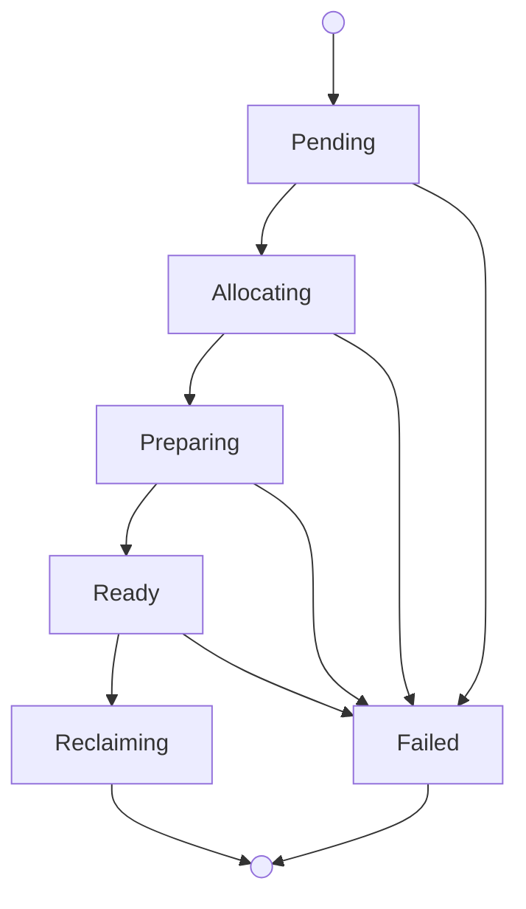

Each bare-metal machine gives you exclusive use of one physical Apple Silicon
Mac. Choose bare metal when you need dedicated hardware, root-capable admin
access, direct device control, or the full power of a physical host.

You manage bare metal through the `mthr` CLI or by creating `BareMetalMachine`
resources in your Mount Thor Kubernetes control plane.

## Lifecycle



What to know:

- A `BareMetalMachine` stays allocated until you free it. Closing an SSH
  session does not release the machine.
- When you connect, you get a machine-scoped macOS user with local admin access
  and passwordless `sudo`.
- Mount Thor bills each bare-metal machine for a minimum of 24 hours. If you
  free a machine after 2 hours, you are still billed for 24 hours.
- If spot capacity is enabled for your account, Mount Thor uses reserved
  capacity first and allocates spot machines when reserved capacity is
  exhausted.

## Allocate a Machine

Check what hardware classes and images are available:

```bash
mthr fleet images
```

Allocate interactively — the CLI prompts for a machine name, hardware class,
and image:

```bash
mthr bm allocate
```

Or specify everything on the command line:

```bash
mthr bm allocate {BM_NAME} --class m4-24g --image xcode-16
```

Mount Thor selects a host from your reserved (or spot) capacity, installs the
image, and prepares the machine for access. Wait for `Ready`, then connect.

## Connect

### SSH

```bash
mthr bm ssh {BM_NAME}
```

### Desktop Access

```bash
mthr bm desktop {BM_NAME}
```

This opens a private tunnel and launches Apple Screen Sharing. Keep the CLI
running while connected. Use `--print` to print the VNC URL instead of opening
it automatically.

### Tunnel

```bash
mthr bm tunnel {BM_NAME} --port-name {PORT_NAME} --local-port {LOCAL_PORT}
```

## List and Inspect

```bash
mthr bm ls
mthr bm get {BM_NAME}
```

## Free a Machine

```bash
mthr bm free {BM_NAME}
```

Mount Thor revokes access, securely wipes the host, and returns it to the
pool. You cannot reconnect to a machine once you have freed it.

For fleet-wide capacity monitoring, spot policy, and the image catalog, see
[Fleet & Capacity](/platform/fleet-capacity).

## Kubernetes Resource Reference

### Allocate with kubectl

Save the following to a file called `machine.yaml`:

```yaml
apiVersion: compute.mountthor.com/v1alpha1
kind: BareMetalMachine
metadata:
  name: {BM_NAME}
spec:
  class: m4-24g
  image: xcode-16
```

Then apply it and wait for the machine to become ready:

```bash
kubectl apply -f machine.yaml
kubectl wait baremetalmachine {BM_NAME} \
  --for=jsonpath='{.status.readyForAccess}'=true \
  --timeout=30m
```

### List and Inspect with kubectl

```bash
kubectl get baremetalmachines
kubectl get baremetalmachine {BM_NAME} -o yaml
```

### Free with kubectl

```bash
kubectl delete baremetalmachine {BM_NAME}
```

### BareMetalMachine

| Field | Required | Description |
|---|---|---|
| `spec.class` | yes | Machine class (e.g. `m4-24g`, `m4-pro-128g`). Immutable. |
| `spec.image` | no | Image name (e.g. `xcode-16`). Defaults applied by the platform. |
| `spec.region` | no | Target region when multiple regions are available. Immutable. |

For hardware classes and images, see the
[Fleet & Capacity](/platform/fleet-capacity) Kubernetes Resource Reference.

### Status Contract

Every `BareMetalMachine` exposes a consistent status shape:

```yaml
status:
  observedGeneration: 1
  phase: Ready
  capacitySource: reserved
  readyForAccess: true
  access:
    ssh: true
    desktop: true
    tunnels: true
  conditions:
    - type: Ready
      status: "True"
      reason: MachineReady
      message: "machine is ready for access"
```

Lifecycle phases: `Pending`, `Allocating`, `Preparing`, `Ready`, `Reclaiming`,
`Failed`.

The `capacitySource` field shows whether the machine is using `reserved` or
`spot` capacity.
