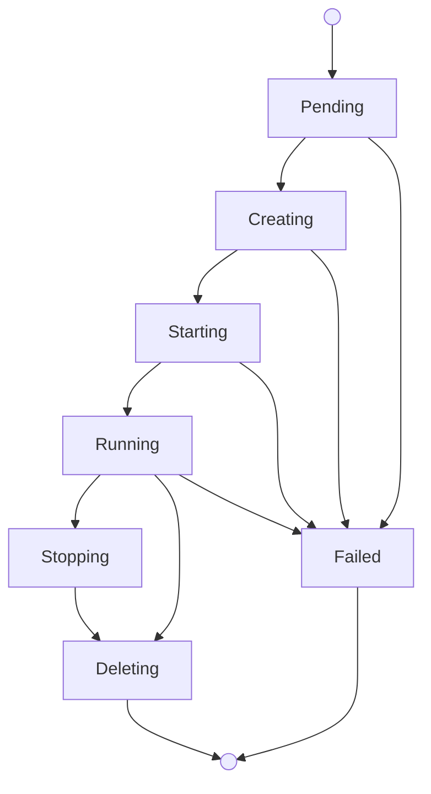

Virtual machines give you isolated macOS environments on Mount Thor-managed
Apple Silicon capacity. Use VMs when you want faster provisioning, parallel
macOS guests, or a fresh environment for each run.

You manage VMs through the `mthr` CLI or by creating `VirtualMachine` resources
in your Mount Thor Kubernetes control plane.

During alpha, create VMs from Mount Thor-provided images. Customer-owned VM
images are coming soon.

## Lifecycle



What to know:

- Mount Thor places the VM on eligible capacity, prepares the image, boots
  macOS, and publishes your requested ports.
- Cold starts can take several minutes while the image is prepared on the host.
  Warm starts are faster when the image is already cached.
- Connect with SSH, desktop access, or application port tunnels through the
  `mthr` CLI. Mount Thor does not expose guest IPs directly.

## Create a VM

Check available images:

```bash
mthr fleet images
```

Create interactively — the CLI prompts for a name, image, CPU, memory, and
disk size:

```bash
mthr vm create
```

Or specify everything on the command line:

```bash
mthr vm create {VM_NAME} --image macos-15-dev-base \
  --cpu 4 --memory 8 --disk 100 \
  --port ssh=tcp:22 --port app=tcp:8443
```

Each `--port` flag defines a named port as `name=protocol:guestPort`. Use these
names with `mthr vm tunnel` to open local tunnels later.

## Connect

### SSH

```bash
mthr vm ssh {VM_NAME}
```

### Desktop Access

```bash
mthr vm desktop --name {VM_NAME}
```

This opens a private tunnel and launches Apple Screen Sharing. Keep the CLI
running while connected. Use `--print` to print the VNC URL instead of opening
it automatically.

### Application Port Tunnels

Open a local tunnel to a named port you defined at creation time:

```bash
mthr vm tunnel {VM_NAME} --port-name app --local-port 8443
```

`--port-name` selects one of the ports from `--port name=proto:guestPort` at
creation. `--local-port` is the port on your workstation.

## Inspect Status

```bash
mthr vm ls
mthr vm get {VM_NAME}
```

## Delete a VM

```bash
mthr vm delete {VM_NAME}
```

## Kubernetes Resource Reference

### Create a VM with kubectl

Save the following to a file called `vm.yaml`:

```yaml
apiVersion: compute.mountthor.com/v1alpha1
kind: VirtualMachine
metadata:
  name: {VM_NAME}
spec:
  imageRef: macos-15-dev-base
  resources:
    cpu: 4
    memoryGiB: 8
    diskGiB: 100
  ports:
    - name: ssh
      guestPort: 22
      protocol: tcp
      exposure: private-tunnel
    - name: app
      guestPort: 8443
      protocol: tcp
      exposure: private-tunnel
```

Then apply it and watch for the VM to start running:

```bash
kubectl apply -f vm.yaml
kubectl get virtualmachine {VM_NAME} --watch
```

### VirtualMachine Fields

| Field | Required | Description |
|---|---|---|
| `spec.imageRef` | yes | Image name. Immutable. |
| `spec.resources.cpu` | yes | vCPU count. |
| `spec.resources.memoryGiB` | yes | Memory in GiB. |
| `spec.resources.diskGiB` | yes | Boot disk in GiB. |
| `spec.ports` | no | Named ports to publish for access and tunnels. |

Port fields:

| Field | Required | Description |
|---|---|---|
| `name` | yes | Unique port name within the VM. |
| `guestPort` | yes | Port inside the guest (1-65535). |
| `protocol` | no | `tcp` (default). |
| `exposure` | no | `private-tunnel` for tunnel-based access. |

### Inspect with kubectl

```bash
kubectl get virtualmachines
kubectl get virtualmachine {VM_NAME} -o yaml
```

### Delete with kubectl

```bash
kubectl delete virtualmachine {VM_NAME}
```

### Status Contract

```yaml
status:
  observedGeneration: 1
  phase: Running
  capacitySource: reserved
  readyForAccess: true
  access:
    ssh: true
    desktop: true
    tunnels: true
  conditions:
    - type: Ready
      status: "True"
      reason: GuestRunning
      message: "VM is running."
```

Lifecycle phases: `Pending`, `Creating`, `Starting`, `Running`, `Stopping`,
`Deleting`, `Failed`.

The `capacitySource` field shows whether the VM is using `reserved` or `spot`
capacity.

### Bootstrap Data

Use bootstrap data when the guest needs non-secret startup instructions such
as creating files or starting services.

Create a `ConfigMap` in your tenant namespace with the
`compute.mountthor.com/customer-bootstrap` label:

```yaml
apiVersion: v1
kind: ConfigMap
metadata:
  name: dev-bootstrap
  labels:
    compute.mountthor.com/customer-bootstrap: "true"
data:
  script: |
    #!/bin/sh
    set -eu
    echo "hello from Mount Thor" > /Users/admin/hello.txt
```

```bash
kubectl apply -f dev-bootstrap.yaml
```

VMs in the same namespace automatically pick up labeled bootstrap ConfigMaps.

<Warning>
  Bootstrap ConfigMaps are non-secret user data. Do not put API keys, session
  tokens, registry credentials, SSH private keys, passwords, or other secrets
  in them.
</Warning>

Only ConfigMaps labeled `compute.mountthor.com/customer-bootstrap=true` are
accepted for VM bootstrap.

## Customer-Owned Images

**Status: Coming Soon**

During alpha, use Mount Thor-provided images. Customer-owned image support will
add registry connection and image import workflows after the alpha path is
ready.
