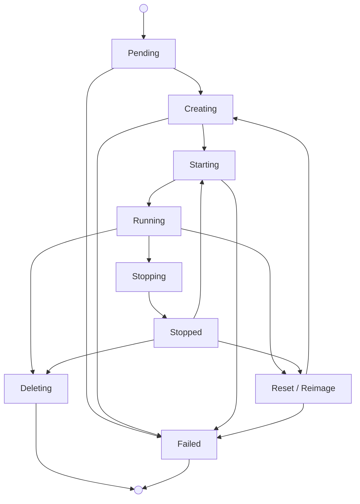

Virtual machines give you isolated macOS environments on Mount Thor-managed
Apple Silicon capacity. Use VMs when you want faster provisioning than bare
metal, parallel macOS guests, or a fresh environment for each run.

During alpha, create VMs from Mount Thor-provided images. Customer-owned VM
images are coming soon.

## Virtual Machine Lifecycle



What to know:

- A `VirtualMachineImage` selects the macOS image and VM profile.
- Mount Thor places the VM on eligible capacity, prepares the image when
  needed, boots macOS, applies bootstrap data, and publishes requested SSH and
  application ports.
- Cold starts can take several minutes when Mount Thor prepares the image on a
  host. Warm starts are faster because the selected image is already cached on
  the host.
- Connect with the Mount Thor CLI over SSH, desktop access, or application port
  tunnels. Mount Thor does not expose the guest IP as the connection interface.
- The CLI brokers VM desktop access through a private `screen` tunnel and a
  short-lived `VirtualMachineDesktopSession`. You do not set a VNC password in
  the guest; the CLI generates a one-time local password only for the
  loopback Apple Screen Sharing connection.
- Deleting a VM removes the VM instance and its access tunnels. The image
  remains available, but future VM creation still depends on your reserved
  capacity or available on-demand capacity.

## Virtual Machine Resources

- [`VirtualMachine`](/api-reference/compute/list-virtualmachines): the macOS VM
  instance you create, inspect, connect to, and delete.
- [`VirtualMachineImage`](/api-reference/compute/list-virtualmachineimages):
  the approved image and VM profile you choose before creating a VM.
- [`VirtualMachineOperation`](/api-reference/compute/list-virtualmachineoperations):
  the reset or reimage request for an existing VM.
- [`VirtualMachineImageOperation`](/api-reference/compute/list-virtualmachineimageoperations):
  the image import or capture operation. Customer-owned image flows are coming
  soon.

## Create and Connect

Create a VM with the Mount Thor CLI. The CLI creates the `VirtualMachine`,
installs your SSH public key through non-secret bootstrap data, waits for the VM
to start, and opens SSH.

Install the CLI:

```bash
curl -fsSL https://get.mountthor.com/install.sh | sh
mountthor --version
```

The VM SSH flow requires Mount Thor CLI `0.3.5` or newer. VM desktop access
requires Mount Thor CLI `0.3.9` or newer.

Set your customer kubeconfig path and tenant namespace:

```bash
export KCFG="/path/to/customer.kubeconfig"
export NS="tenant-example"
```

List the VM images enabled for your account:

```bash
kubectl --kubeconfig "$KCFG" -n "$NS" get virtualmachineimages
```

Use one `VirtualMachineImage` name for `IMAGE`. In this example,
`macos-15-dev-base` is the VM image.

```bash
export VM="vm-01"
export IMAGE="macos-15-dev-base"
export KEY="$HOME/.ssh/mountthor-$VM"
export KNOWN_HOSTS="$HOME/.ssh/mountthor-$VM-known-hosts"
```

Create a local SSH key for this VM:

```bash
mkdir -p "$HOME/.ssh"
test -f "$KEY" || ssh-keygen -t ed25519 -f "$KEY" -N "" -C "mountthor-$VM"
chmod 600 "$KEY"
```

Keep the private key for this VM. Mount Thor installs the matching public key
when you create or recreate the VM; creating a new local key later does not
update an existing guest.

Read the SSH username from the selected image:

```bash
export VM_USER="$(
  kubectl --kubeconfig "$KCFG" -n "$NS" get virtualmachineimages.vm.mountthor.dev "$IMAGE" \
    -o jsonpath='{.spec.guestBootstrap.username}'
)"
echo "$VM_USER"
```

Create the VM with SSH access:

```bash
KUBECONFIG="$KCFG" mountthor vm create "$VM" \
  --namespace "$NS" \
  --image "$IMAGE" \
  --port ssh=tcp:22 \
  --ssh-user "$VM_USER" \
  --ssh-public-key-file "$KEY.pub" \
  --wait
```

The command returns after Mount Thor creates the VM, installs your public key,
and the VM reaches its running state.

Connect with SSH:

```bash
KUBECONFIG="$KCFG" mountthor vm ssh "$VM" \
  --namespace "$NS" \
  --ssh-user "$VM_USER" \
  --identity-file "$KEY" \
  --known-hosts-file "$KNOWN_HOSTS"
```

## Inspect Status

Inspect the VM with the CLI:

```bash
KUBECONFIG="$KCFG" mountthor vm get "$VM" --namespace "$NS"
```

Read the VM image, phase, ready timestamp, and failure code:

```bash
kubectl --kubeconfig "$KCFG" -n "$NS" get virtualmachines.vm.mountthor.dev "$VM" \
  -o custom-columns=NAME:.metadata.name,IMAGE:.spec.imageRef,PHASE:.status.phase,READY:.status.readyAt,FAILURE:.status.failureCode
```

Read startup timing fields:

```bash
kubectl --kubeconfig "$KCFG" -n "$NS" get virtualmachine "$VM" \
  -o jsonpath='{.status.timings.requestAcceptedAt}{" guestReady="}{.status.timings.guestReadyProbePassedAt}{" portsPublished="}{.status.timings.portsPublishedAt}{" servicesReady="}{.status.timings.servicesReadyAt}{" customerReady="}{.status.timings.customerReadyAt}{"\n"}'
```

Empty timing fields mean the VM has not reached that step yet. If `failure` is
populated, use that value when contacting Mount Thor.

## Publish Application Ports

Choose the ports you want to publish when you create the VM. The SSH example
above publishes only port `22`. To publish an application port as well, include
the application port in the original `mountthor vm create` command. Use this
version instead of the SSH-only create command above:

```bash
KUBECONFIG="$KCFG" mountthor vm create "$VM" \
  --namespace "$NS" \
  --image "$IMAGE" \
  --port ssh=tcp:22 \
  --port app=tcp:8443 \
  --ssh-user "$VM_USER" \
  --ssh-public-key-file "$KEY.pub" \
  --wait
```

After the VM is running, read the access command from VM status:

```bash
kubectl --kubeconfig "$KCFG" -n "$NS" get virtualmachine "$VM" \
  -o jsonpath='{.status.publishedPorts[?(@.name=="app")].accessCommand}{"\n"}'
```

Run the returned `mountthor vm tunnel` command with a local port value. If the
VM already exists and you need to publish a new port, recreate it with the full
port list during alpha.

## Open Desktop Access

Open desktop access from your workstation:

```bash
KUBECONFIG="$KCFG" mountthor vm desktop "$VM" \
  --namespace "$NS" \
  --local-port 15900 \
  --timeout 5m
```

The command creates a short-lived desktop session, opens a private tunnel to the
VM `screen` port, and prints an Apple Screen Sharing URI such as
`vnc://:<local-password>@127.0.0.1:15900`. Keep the command running while the
desktop client is connected.

```bash
open 'vnc://:<local-password>@127.0.0.1:15900'
```

Use the exact URI printed by the CLI. The local password is generated for that
CLI run, is accepted only by the loopback tunnel, and is not a macOS user
password or a Mount Thor API secret. The VM desktop session itself is
authorized through your compute session and the temporary
`VirtualMachineDesktopSession`.

## Operate a VM

Reset a VM when you want to recreate it from the same image:

```bash
KUBECONFIG="$KCFG" mountthor vm reset "$VM" \
  --namespace "$NS" \
  --reason "Refresh VM state." \
  --wait
```

Reimage a VM when you want to replace its image:

```bash
export NEW_IMAGE="macos-15-dev-base"

KUBECONFIG="$KCFG" mountthor vm reimage "$VM" \
  --namespace "$NS" \
  --image "$NEW_IMAGE" \
  --wait
```

Delete a VM when you are done with the instance:

```bash
KUBECONFIG="$KCFG" mountthor vm delete "$VM" --namespace "$NS"
```

Deleting a VM removes the VM instance and its access tunnels. It does not
remove the `VirtualMachineImage`.

## Advanced: Kubernetes Resources

The Mount Thor CLI is the recommended path for alpha. You can also create the
underlying Kubernetes resources directly.

Save the following as `vm-01.json`:

```json
{
  "apiVersion": "vm.mountthor.dev/v1alpha1",
  "kind": "VirtualMachine",
  "metadata": {
    "name": "vm-01"
  },
  "spec": {
    "imageRef": "macos-15-dev-base",
    "powerState": "Running",
    "ports": [
      {
        "name": "app",
        "protocol": "tcp",
        "guestPort": 8443,
        "exposure": "private-tunnel"
      }
    ]
  }
}
```

Apply the VM:

```bash
kubectl --kubeconfig "$KCFG" -n "$NS" apply -f vm-01.json
kubectl --kubeconfig "$KCFG" -n "$NS" get virtualmachine vm-01 --watch
```

Port constraints:

- `name` is required and must be unique within the VM.
- `guestPort` must be `1-65535`.
- `protocol` defaults to `tcp` when omitted.
- `exposure` may be omitted for an unpublished port; the only published
  exposure value is `private-tunnel`.

## Advanced: Non-Secret Bootstrap

Use bootstrap data only when the guest needs non-secret startup instructions,
such as creating a file, starting a local service, or preparing a test command.

Bootstrap data is stored in a tenant-scoped `ConfigMap` labeled for VM
bootstrap. Save the following as `vm-01-bootstrap.json`:

```json
{
  "apiVersion": "v1",
  "kind": "ConfigMap",
  "metadata": {
    "name": "vm-01-bootstrap",
    "labels": {
      "vm.mountthor.dev/customer-bootstrap": "true"
    }
  },
  "data": {
    "script": "#!/bin/sh\nset -eu\necho \"hello from Mount Thor\" > /Users/admin/hello.txt\n"
  }
}
```

```bash
kubectl --kubeconfig "$KCFG" -n "$NS" apply -f vm-01-bootstrap.json
```

Reference the bootstrap `ConfigMap` from the VM:

```json
{
  "apiVersion": "vm.mountthor.dev/v1alpha1",
  "kind": "VirtualMachine",
  "metadata": {
    "name": "vm-01"
  },
  "spec": {
    "imageRef": "macos-15-dev-base",
    "bootstrap": {
      "metadataService": {},
      "userDataConfigMapRef": "vm-01-bootstrap"
    },
    "powerState": "Running"
  }
}
```

<Warning>
  Bootstrap ConfigMaps are non-secret user data. Do not put Mount Thor API
  keys, session tokens, registry credentials, SSH private keys, passwords, or
  other secret material in them. Kubernetes `Secret` objects are not part of
  the customer compute API.
</Warning>

Only ConfigMaps labeled `vm.mountthor.dev/customer-bootstrap=true` are accepted
for VM bootstrap. Generic ConfigMaps, unlabeled ConfigMaps, Secrets, provider
inventory, and internal Mount Thor resources are denied.

## Customer-Owned Images

**Status: Coming Soon**

Customer-owned VM images are not available during alpha. During alpha, use
Mount Thor-provided VM images. Customer-owned image support will add registry
connection and image import workflows after the alpha path is ready for
customers.
