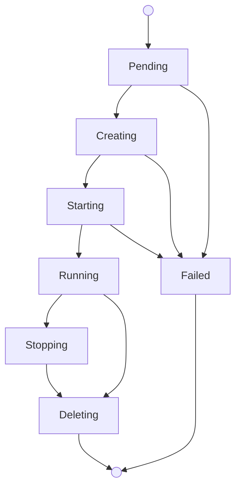

Virtual machines give you isolated macOS environments on Mount Thor-managed
Apple Silicon capacity. Use VMs when you want faster provisioning, parallel
macOS guests, or a fresh environment for each run.

You manage VMs through the `mthr` CLI or by creating `VirtualMachine` resources
in your Mount Thor Kubernetes control plane.

During alpha, create VMs from Mount Thor-provided images. Customer-owned VM
images are coming soon.

## Lifecycle



What to know:

- Mount Thor places the VM on eligible capacity, prepares the image, boots
  macOS, and publishes your requested ports.
- Cold starts can take several minutes while the image is prepared on the host.
  Warm starts are faster when the image is already cached.
- Connect with SSH, desktop access, or application port tunnels through the
  `mthr` CLI. Mount Thor does not expose guest IPs directly.
- Deleting a VM removes the instance and its access tunnels. The image stays
  in the catalog.

## Create a VM

Check available images:

```bash
mthr fleet images
```

Create a VM with resource requests and ports:

```bash
mthr vm create dev --image macos-15-dev-base \
  --cpu 4 --memory 8 --disk 100 \
  --port ssh=tcp:22 --port app=tcp:8443
```

This creates a `VirtualMachine` resource. Mount Thor places the VM, prepares
the image, boots macOS, and publishes the requested ports.

## Connect

### SSH

SSH into a running VM:

```bash
mthr vm ssh dev
```

The CLI waits for the VM to be ready (up to 30 seconds by default), brokers
a short-lived SSH grant, and launches `ssh`.

To run a command instead of opening an interactive session:

```bash
mthr vm ssh dev -- uname -a
```

### Desktop Access

Open desktop access from your workstation:

```bash
mthr vm desktop --name dev --local-port 15900 --timeout 5m
```

The command opens a private tunnel to the VM screen port and opens an Apple
Screen Sharing URI such as `vnc://127.0.0.1:15900`. Keep the command running
while your desktop client is connected.

```bash
open 'vnc://127.0.0.1:15900'
```

Use `--print` to print the local VNC URI instead of opening it.

### Application Port Tunnels

Open a tunnel to a published application port:

```bash
mthr vm tunnel dev --port-name app --local-port 8443
```

## Inspect Status

List VMs:

```bash
mthr vm ls
```

Get details for a specific VM:

```bash
mthr vm get dev
```

Or with kubectl:

```bash
kubectl get virtualmachines
kubectl get virtualmachine dev -o yaml
```

## Delete a VM

Delete a VM when you are done:

```bash
mthr vm delete dev
```

Or with kubectl:

```bash
kubectl delete virtualmachine dev
```

Deleting a VM removes the instance, its published ports, and any active access
grants. The image stays in the catalog for future use.

## Kubernetes Resource Reference

### VirtualMachine

Create a VM directly with kubectl:

```yaml
apiVersion: compute.mountthor.com/v1alpha1
kind: VirtualMachine
metadata:
  name: dev
spec:
  image: macos-15-dev-base
  resources:
    cpu: 4
    memoryGiB: 8
    diskGiB: 100
  ports:
    - name: ssh
      guestPort: 22
      protocol: tcp
      exposure: private
    - name: app
      guestPort: 8443
      protocol: tcp
      exposure: private
```

```bash
kubectl apply -f dev.yaml
kubectl get virtualmachine dev --watch
```

| Field | Required | Description |
|---|---|---|
| `spec.image` | yes | Image name. Immutable. |
| `spec.resources.cpu` | yes | vCPU count. |
| `spec.resources.memoryGiB` | yes | Memory in GiB. |
| `spec.resources.diskGiB` | yes | Boot disk in GiB. |
| `spec.ports` | no | Named ports to publish for access and tunnels. |

Port fields:

| Field | Required | Description |
|---|---|---|
| `name` | yes | Unique port name within the VM. |
| `guestPort` | yes | Port inside the guest (1–65535). |
| `protocol` | no | `tcp` (default). |
| `exposure` | no | `private` for tunnel-based access. |

### Status Contract

```yaml
status:
  observedGeneration: 1
  phase: Running
  capacitySource: reserved
  readyForAccess: true
  failureCode: null
  access:
    ssh: true
    desktop: true
    tunnels: true
  conditions:
    - type: Ready
      status: "True"
      reason: GuestRunning
      message: "VM is running."
```

Lifecycle phases: `Pending`, `Creating`, `Starting`, `Running`, `Stopping`,
`Deleting`, `Failed`.

### Bootstrap Data

Use bootstrap data when the guest needs non-secret startup instructions such
as creating files or starting services.

Bootstrap data is stored in a tenant-scoped `ConfigMap`:

```yaml
apiVersion: v1
kind: ConfigMap
metadata:
  name: dev-bootstrap
  labels:
    compute.mountthor.com/customer-bootstrap: "true"
data:
  script: |
    #!/bin/sh
    set -eu
    echo "hello from Mount Thor" > /Users/admin/hello.txt
```

```bash
kubectl apply -f dev-bootstrap.yaml
```

Reference the ConfigMap from the VM spec:

```yaml
spec:
  image: macos-15-dev-base
  bootstrap:
    metadataService: {}
    userDataConfigMapRef: dev-bootstrap
```

<Warning>
  Bootstrap ConfigMaps are non-secret user data. Do not put API keys, session
  tokens, registry credentials, SSH private keys, passwords, or other secrets
  in them.
</Warning>

Only ConfigMaps labeled `compute.mountthor.com/customer-bootstrap=true` are
accepted for VM bootstrap.

## Customer-Owned Images

**Status: Coming Soon**

During alpha, use Mount Thor-provided images. Customer-owned image support will
add registry connection and image import workflows after the alpha path is
ready.
